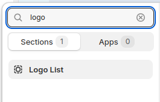
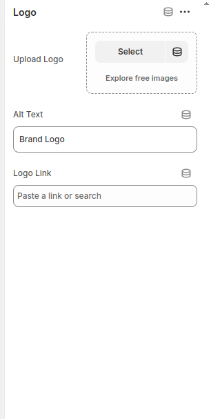
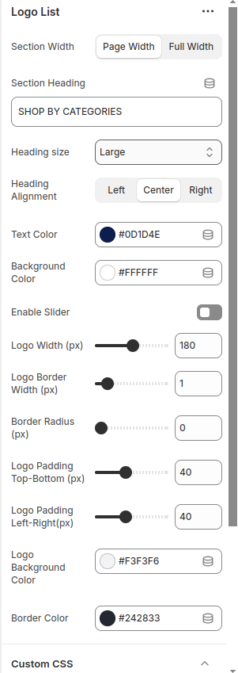

# Logo List with Slider

The Logo List section displays a visually appealing lineup of brand or partner logos, adding credibility and trust to your store. This section helps highlight key brands, sponsors, or featured partners in a clean and organized layout. Whether showcasing well-known names or exclusive collaborations, the logo list enhances brand recognition and provides a seamless browsing experience.

## Installation and Running Instructions

1. In your theme code, navigate to the **Sections** folder and create a file `logo-list.liquid`. Paste the provided code into this file.
2. Customize the section:

   - Go to **Theme Customization** and add the **Logo List** section to your theme.
      
     

   - To add a new brand logo, just add a new block and customize it to fit your needs. Adjust the size and layout as required.
      
     
     

3. <b>Note: </b>You can add a slider, and change the color and size according to your preferences from the customization options.

## Preview Section

## Technologies Used

- Shopify
- HTML
- Liquid
- CSS
- JavaScript
